# Implementación de buenas prácticas
Para el aporte del estudiante Adam Eliseo López Presas en el presente proyecto se tuvo que revisar manualmente, y con el apoyo de la IA, cada archivo (uno por uno) ubicado en la carpeta app/ del software.

Se encontraron códigos que variaban desde las 30 líneas hasta las 2000, a pesar de eso, el estudiante tuvo que revisar una por una.

### El proceso consistía en:
1. Abrir un archivo
2. Dar una revisión breve y fugaz al código
3. Copiar cada línea del código
4. Solicitar a la IA una revisión detallada
5. Cada punto marcado por la IA era buscado, ubicado y modificado en el código
6. Se realizada una captura previa a la modificación
7. Se realizaba una captura previa a la modificación
8. Una nueva revisión más lenta y detallada al código
9. Se guardaban los cambios realizados
10. Se cerraba el archivo
11. Repetir con el siguiente archivo

## Cambios realizados
Para la realización del issue se solicitó buenas prácticas de la programación:

### **Nomenclatura simple**:
Cualquier función, así como cualquier variable debía contener una nomenclatura profesional. La asiganción de los presentes debía ser mediante nombres identificables, evitando el uso de nombremientos mediante caracteres individuales (una sola letra) y el uso de abreviaciones ambiguas.

Se identifico varias variables cuyo nombre eran una sola letra como puede ser ***x*** o ***i***, así como abreviaciones ambiguas como fue ***btn*** el cual fue reescrito a ***button***.

No se identificaron funciones que cumplieran con alguna sola clausula anteriormente mencionada, es por ello que fueron respetadas.

### **Redundancias**:
Se analizó el código y no se encontró ningún apartado que fuera redundante. Cada componente, ya sea variable, función o llamado cumple una función. No hay ninguna sola pieza que no realice nada.

### **Comentarios**:
Cualquier comentario debía ser analizado y, si mencionaba el propósito del fragmento del código al que hacen referencia deben ser preservados, caso contrario donde expliquen el propósito del código, en dicha situación el comentario debe ser modificado o, como la decisión adoptada por el estuidante, suprimido.

En el código revisado se encontraron varios mensajes, muchos de ellos no cumplían con lo solicitado, referenciando con propósito y no justificación, es por eso que, aunque algunos fueron conservados al no encontrar falta en el cumplimiento, se optó por la eliminación de cada comentario.

## Capturas
A continuación se presentarán capturas de algunos ejemplos de cambios realizados:

### **Abreviaturas**:
Se encontró la variable bg
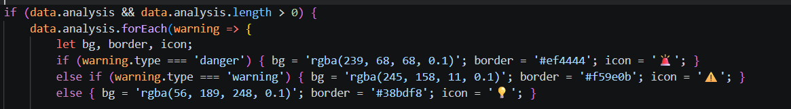

Se realizó el cambio a backgroundColor
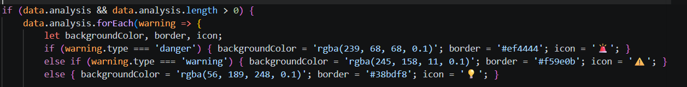

Se encontró la variable val
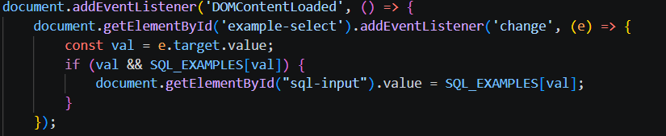

Se realizó el cambio a selectedValue
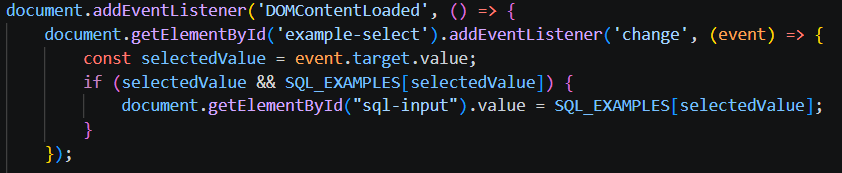

Se encontró la variable stmt_type
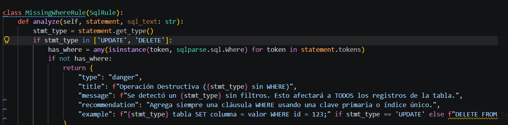

Se realizó el cambio a statement_type
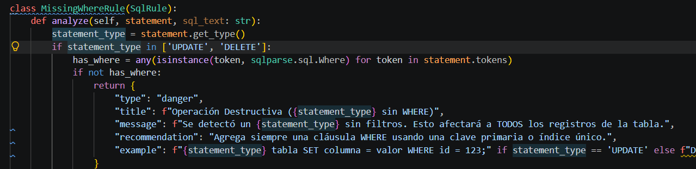

### **Una letra**:
Se encontró la variable a
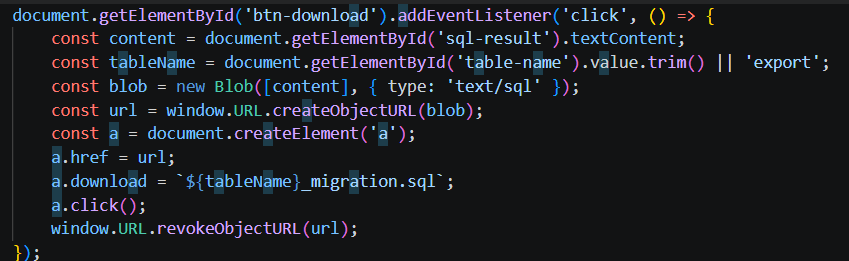

Se realizó el cambio a downloadLink
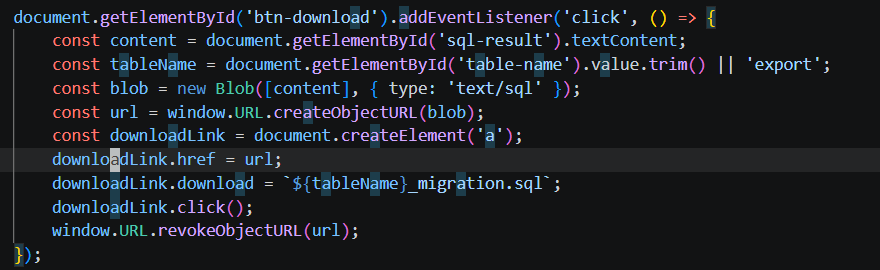

Se encontró la variable k
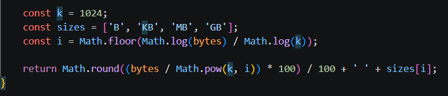

Se realizó el cambio a bytesPerKilobyte
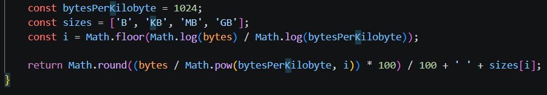

Se encontró la variable i
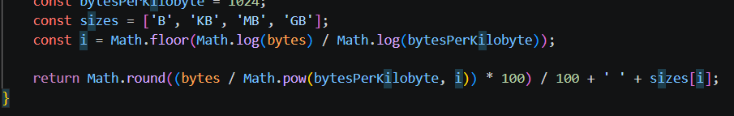

Se realizó el cambio a unitIndex
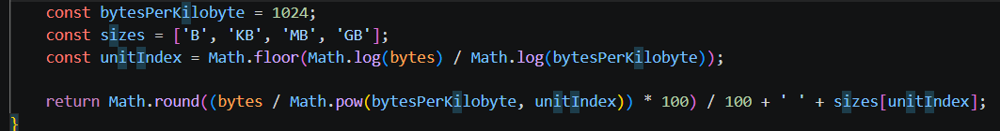

## Conclusión
El trabajo solicitado parece sencillo a simple vista, pero así como experimentó el estudiante de primera mano, no es sencillo porque conlleva una búsqueda exaustiva, una búsqueda donde perder el hilo del recorrido puede ser en extremo fácil y donde, al recorrer tantas líneas y leer tantas letras, puede ser perjudicial causando mareos. Sin embargo, en lo aprendido, el ejercicio sirvió para la actividad de redacción y conocimiento aplicado en futuros proyectos, esto porque el estudiante desea no pasar de nuevo por lo que pasó con esta actividad. Adicionalmente, una cosa buena es que el estudiante logró, así mismo, tener un mejor criterio para el momento de comentar una sección de código.