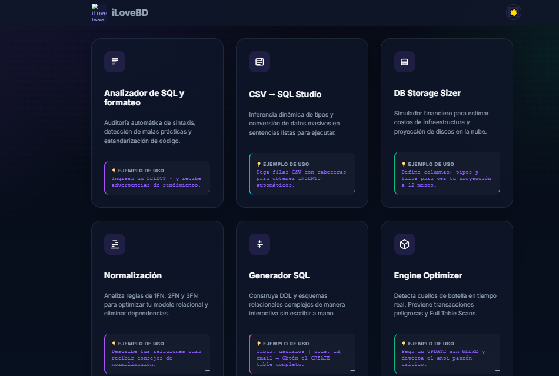
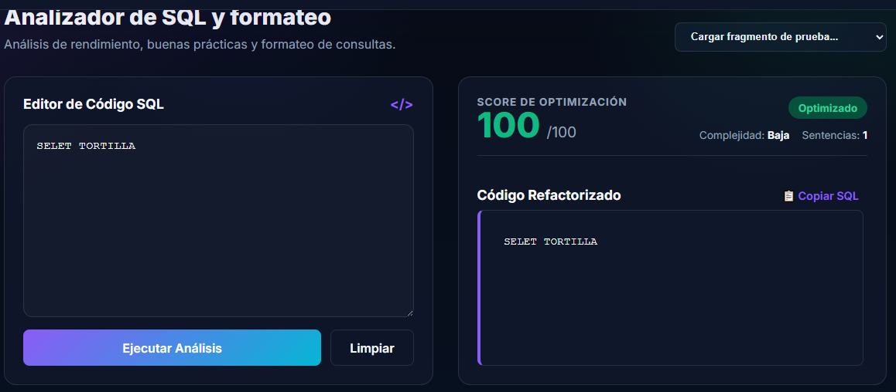
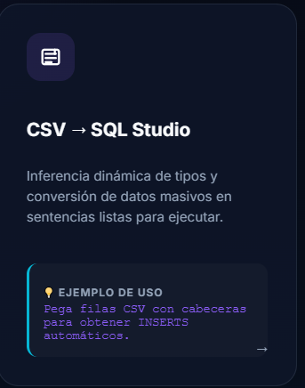
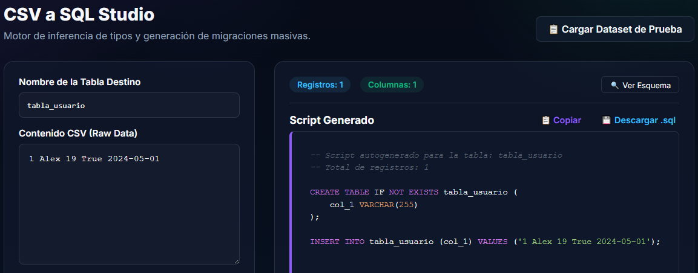
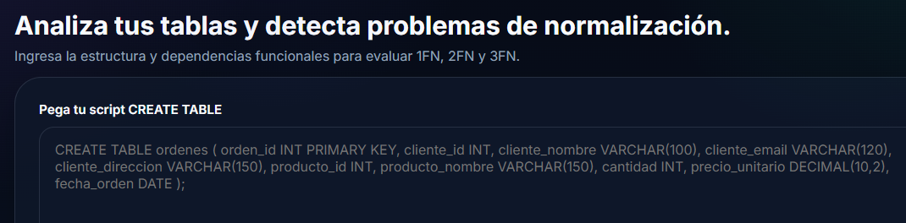
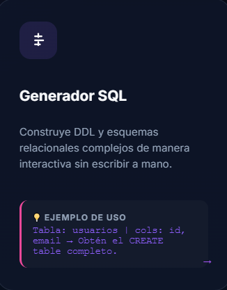
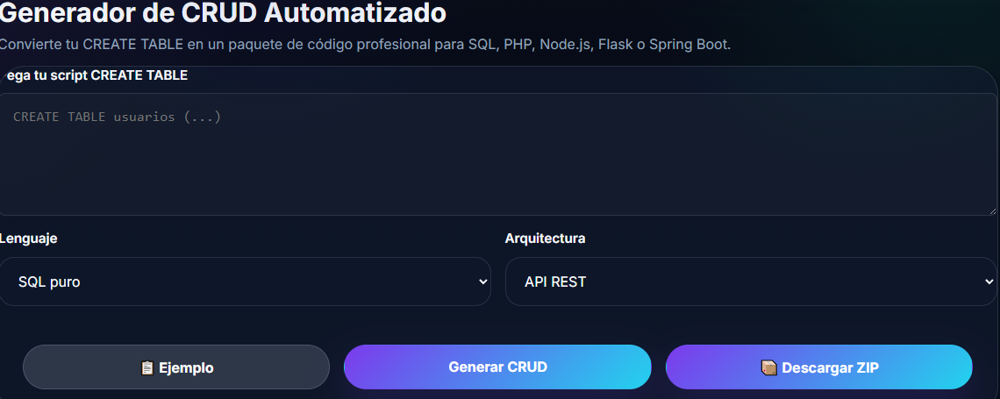
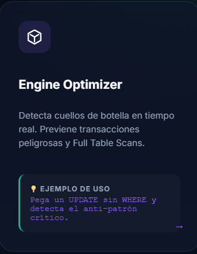
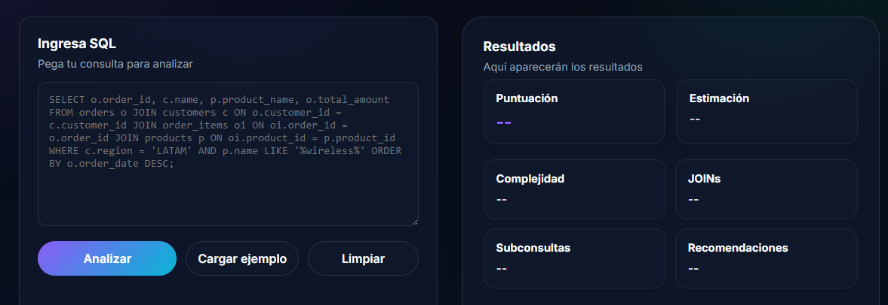

# Documentacion de Funcionamiento

## Inicio del Programa

  

### AnalizadorSQL
Aqui se muestra el funcionamiento basico del Analizador SQL, Modulo encargado del analisis y formateo de consultas SQL, Permitiendo detectar Practicas y consultas peligrosas y Mejorar la legibilidad

  

  

### CSV > SQL
Herramienta orientada a la conversión automática de archivos CSV en scripts SQL, generando estructuras CREATE TABLE y sentencias INSERT de manera automática.

  

  

### DB STORAGE SIZER
Se presenta DB STORAGE SIZER
Es un sistema encargado de Calcular con Aproximaciones la cantidad de almacenamiento y proyeccion de crecimiento de bases de datos a partir de estructuras y tipos de datos definidos

  

  

### Normalizacion 
Descripción:
Herramienta orientada al análisis estructural de bases de datos, detectando redundancia de información y sugiriendo mejoras en el diseño relacional

  

  

### GeneradorSQL 
Descripción:
Módulo que permite generar consultas SQL dinámicamente mediante estructuras configurables y automatización de sentencias

  

  

### Engine Optimizer 
Esta herramienta esta encargada en la optimizacion y del analisis de rendimiento de las consultas SQL detectando posibles problemas de optimizacion y mostrando recomendaciones para mejorar la eficiencia 

  

  

