# Evidencia del Flujo de Trabajo y Entorno de Desarrollo

Para el desarrollo de **iLoveBD**, el equipo adoptó el flujo de trabajo **GitHub Flow**. Esta metodología nos permitió mantener una rama `RamaGenaro` estable en todo momento, desarrollando nuevas funcionalidades en ramas independientes y promoviendo la revisión constante del código a través de *Pull Requests* antes de cada integración.

A continuación, se documenta la participación colaborativa de todos los integrantes y la ejecución del software en los entornos requeridos.

## 1. Creacion de Issues
El proyecto se organizo mediante la creacion estructurada de tareas utilizando *Issues* de GitHub.
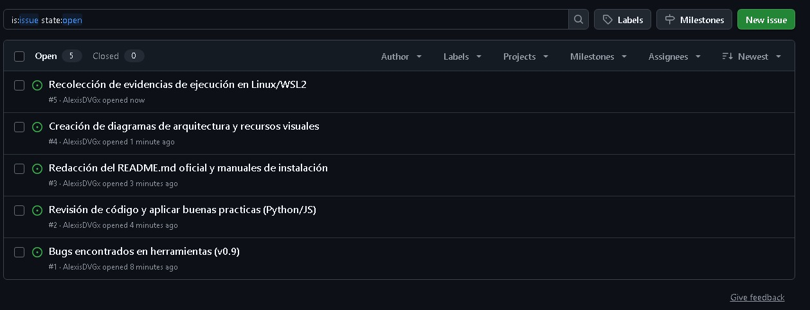.
## 2. Gestión de Tareas (Issues)
Se asignaron los *Issues* de GitHub a cada integrante, permitiendo registrar tareas, mejoras y dar seguimiento al progreso de cada uno.

*Asignacion de Issues.*
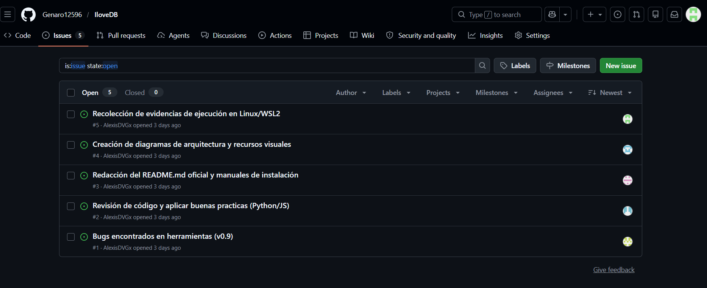
### 2.1 Issue #1 asignado a Alexis David Velazquez Garcia 
*Documentacion de errores y bugs.*
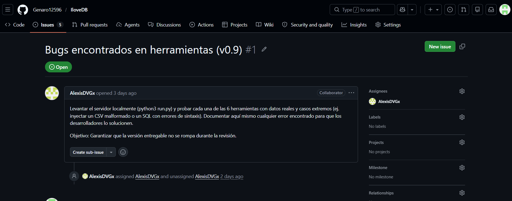

### 2.2 Issue #2 asignado a Adam Eliseo Lopez Presas
*Revision de codigo y buenas practicas.*
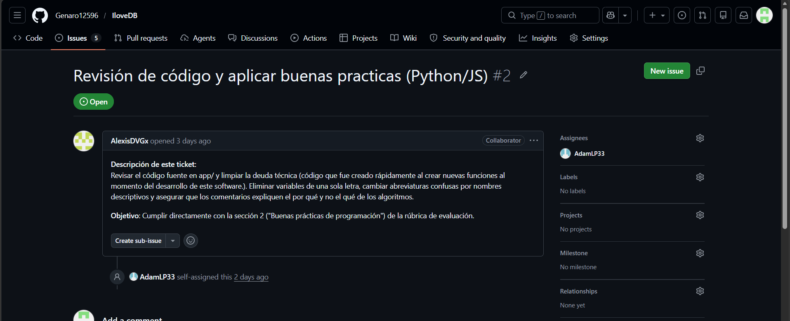

### 2.3 Issue #3 asignado a Anthony Gael Lopez Guerrero
*Redacción del README.md oficial y manuales de instalación.*
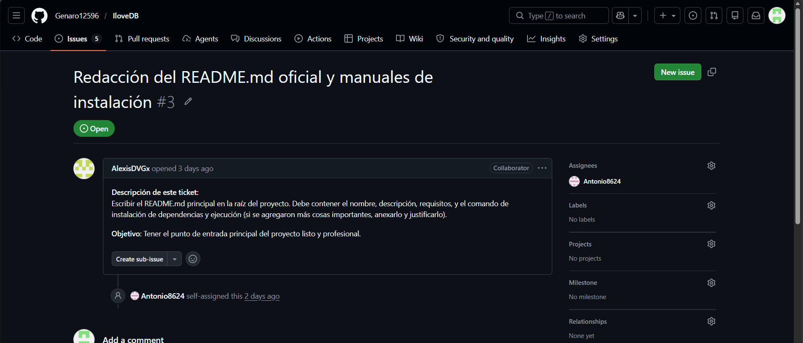

### 2.4 Issue #4 asignado a Moises Alejandro Valdez Avila 
*Creación de diagramas de arquitectura y recursos visuales.*
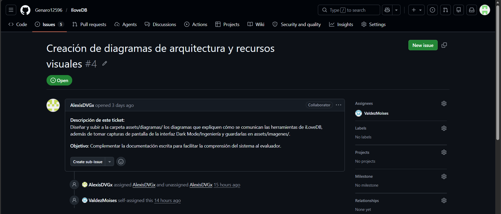

### 2.5 Issue #5 asignado a Genaro Perez Nuñez 
*Recolección de evidencias de ejecución en Linux/WSL2.*
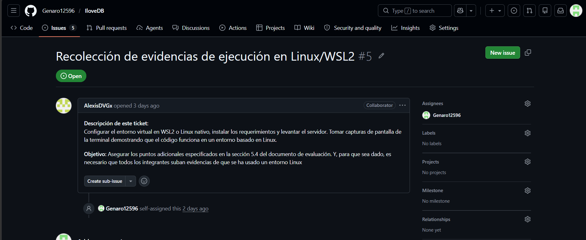

## 3. Creación y Uso de Ramas
Para evitar conflictos directos en producción y mantener un desarrollo aislado, los miembros del equipo que interactuan directamente con codigo trabajaron  en sus propias ramas derivadas de `RamaGenaro`.

*Lista de ramas activas en el repositorio.*
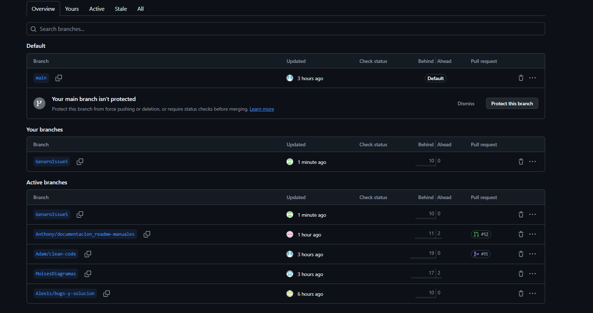

## 4. Trabajo Colaborativo: Commits y Pull Requests
El proceso de integración se realizó mediante *Pull Requests*, asegurando que los cambios fueran revisados y aprobados antes de fusionarlos a la rama principal. Se mantuvo un historial de *commits* frecuentes y descriptivos.

### Adam Eliseo Lopez Presas
*(commit realizando buenas practicas de programación en ILoveBD)*
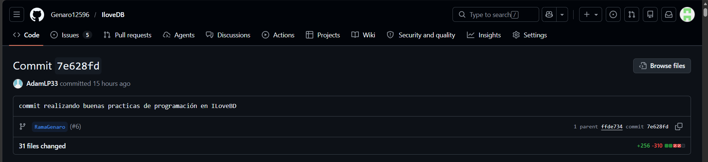
*(Pull request )*
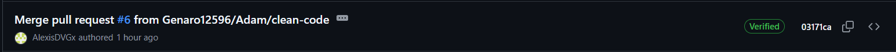

### Moises Alejandro Valdez Avila
*(Commit Se Agregaron 2 Diagramas y se Adjuntaron Las imagenes a Assets)*
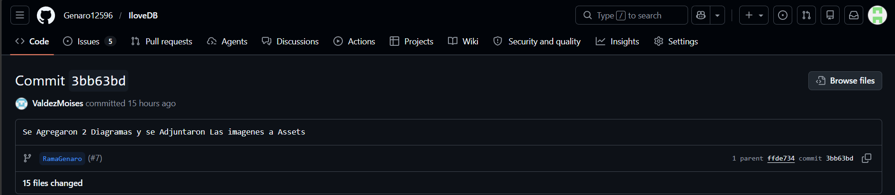
*(Pull request )*
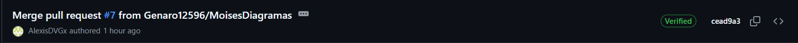

### Anthony Gael Lopez Guerrero
*(commits realizados)*
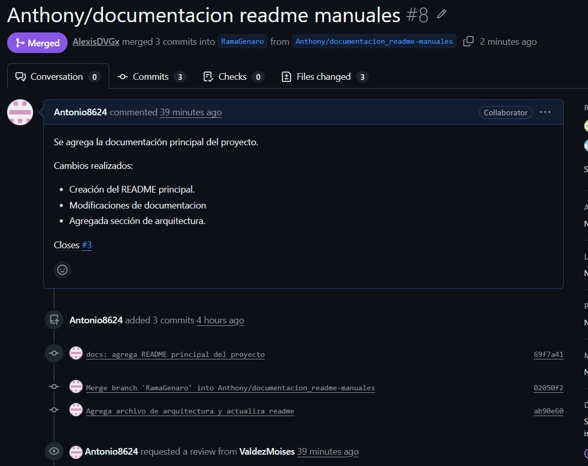
*(Pull request )*
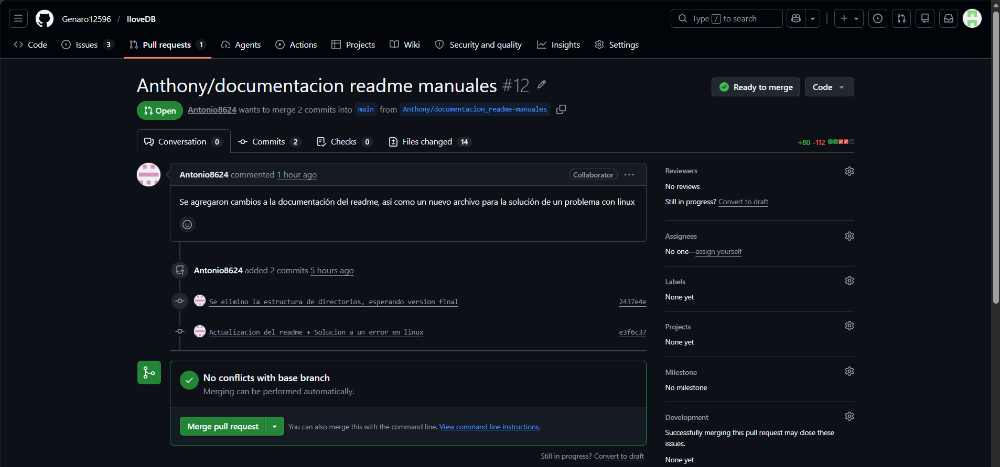

### Alexis David Velazquez Garcia 
*(commits realizados)*
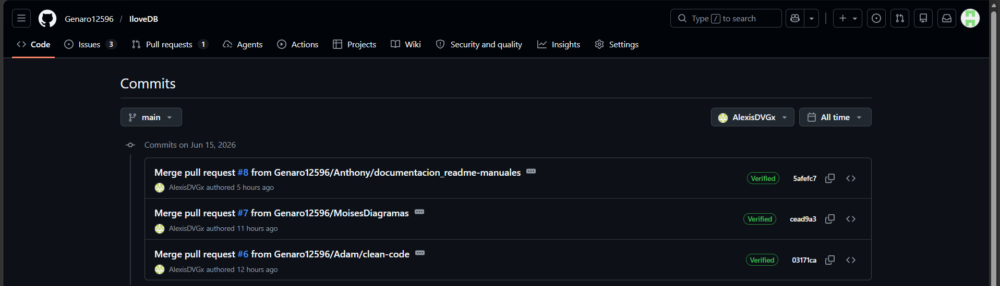
*(Pull request )*
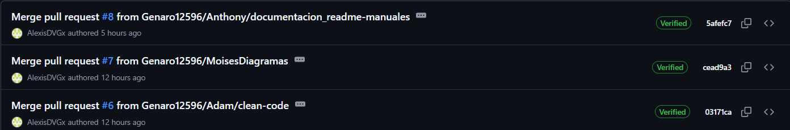

### Genaro Perez Nuñez
*(Commit realizados)*
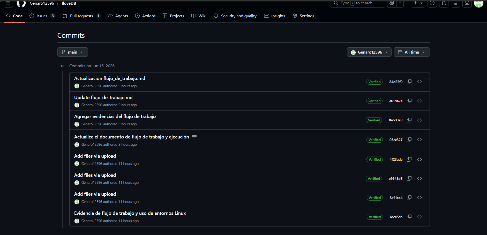
*(Pull request )*
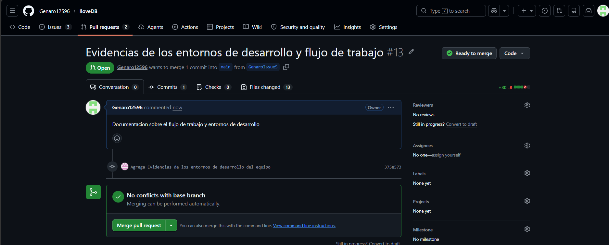

## 5. Entorno de Desarrollo y Ejecución (Linux/WSL2)
Para garantizar un ambiente estandarizado, el proyecto fue desarrollado íntegramente utilizando entornos basados en Linux (WSL2 y distribuciones nativas). Se emplearon entornos virtuales (`venv`) para aislar las dependencias requeridas por Flask.
**Alexis David Velazquez Garcia**
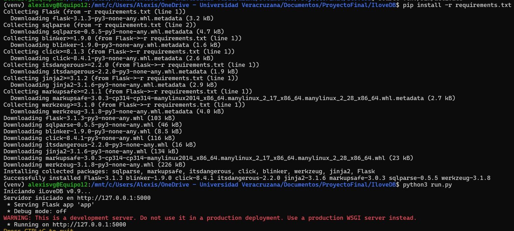

**Genaro Perez Nuñez**
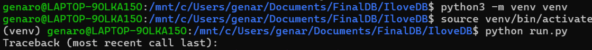

**Adam Eliseo Lopez Presas**
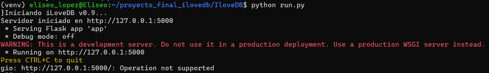

**Anthony Gael Lopez Guerrero**

A continuación se presentan las evidencias de las terminales de cada integrante, demostrando la ejecución local del proyecto en estos entornos:

**Alexis David Velazquez Garcia**
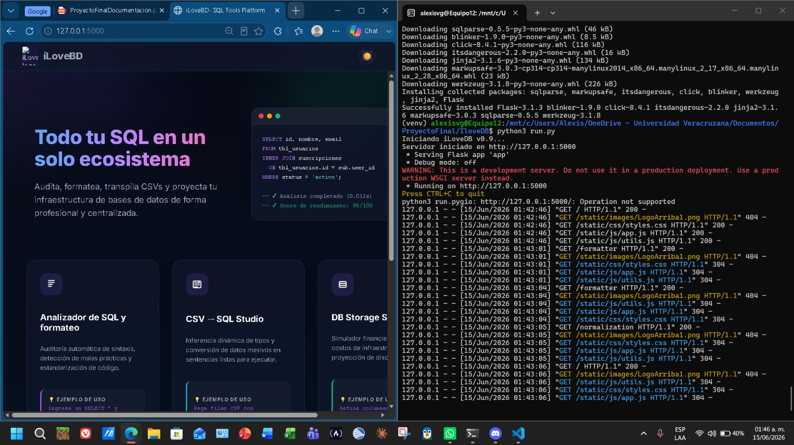

**Anthony Gael Lopez Guerrero**

**Adam Eliseo Lopez Presas**
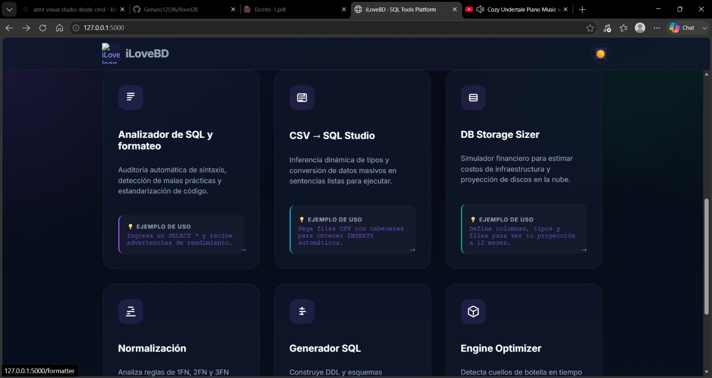

**Moises Alejandro Valdez Avila**
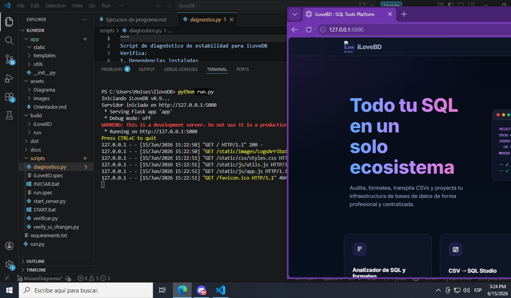

**Genaro Perez Nuñez**
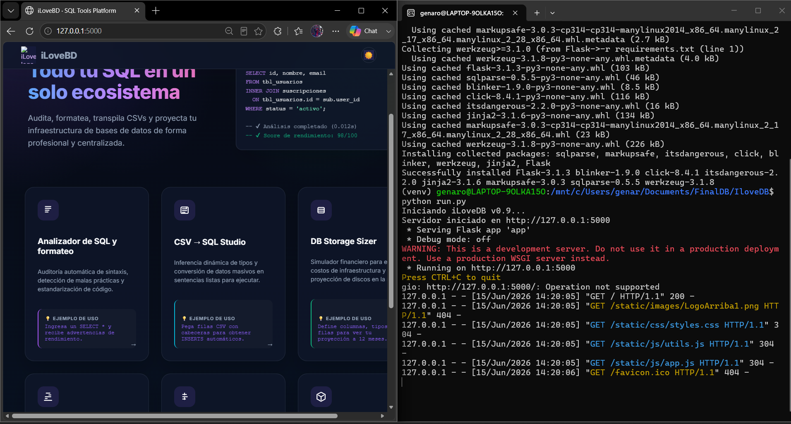
